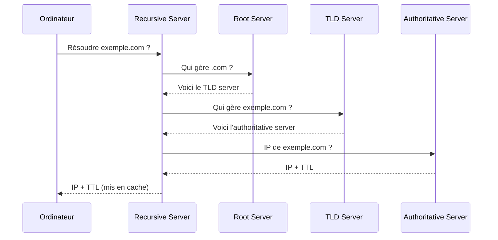

# How The Web Works — TryHackMe Pre-Security

> Rooms couvertes : *DNS in Detail*, *HTTP in Detail*, *How Websites Work*, *Putting it all together*
> Path : Pre-Security

## 📚 Table des matières

- [Résolution DNS](#-résolution-dns)
- [Types de records DNS](#-types-de-records-dns)
- [Méthodes HTTP](#-méthodes-http)
- [Codes de statut HTTP](#-codes-de-statut-http)
- [Headers vs Body](#-headers-vs-body)
- [Client-side vs Server-side](#-client-side-vs-server-side)
- [Cookies et sessions](#-cookies-et-sessions)
- [Putting it all together](#-putting-it-all-together)
- [Erreurs de parcours](#-erreurs-de-parcours)
- [Ce que j'ai retenu](#-ce-que-jai-retenu)

## 🌐 Résolution DNS

Quand on tape une URL dans le navigateur, avant même qu'une requête HTTP parte, il faut résoudre le nom de domaine en adresse IP :

1. La requête part vers un **DNS recursive server**.
2. Le recursive server interroge un **root server** pour savoir qui gère le TLD (`.com`, `.org`...) concerné.
3. Le serveur du TLD répond en indiquant quel **authoritative server** détient les enregistrements de ce domaine.
4. Le recursive server interroge cet **authoritative server**, qui fait correspondre le SLD (le nom de domaine) à une IP (ou à un autre record).
5. La réponse remonte jusqu'au recursive server avec un **TTL** (durée de mise en cache), puis jusqu'à l'ordinateur.
6. Une fois l'IP obtenue, la requête HTTP peut enfin commencer.



### Outils utilisés

```bash
nslookup google.com
nslookup -type=MX google.com
```

`nslookup` permet de récupérer l'IP associée à un domaine (ou inversement), avec l'option `-type` pour cibler un type de record précis.

## 📑 Types de records DNS

| Record | Rôle |
|---|---|
| **A** | Fait correspondre un domaine à une adresse **IP** |
| **CNAME** | Fait pointer un domaine vers un **autre domaine** (alias) — ex: `www.exemple.com` → `exemple.com` |
| **MX** | Indique le(s) serveur(s) responsable(s) des **emails** du domaine |

Quand l'authoritative server renvoie un CNAME au lieu d'une IP directe, le recursive server doit refaire une résolution sur ce nouveau nom de domaine jusqu'à obtenir un record A — chaque étape porte son propre TTL.

## 📨 Méthodes HTTP

- **GET** : récupérer le contenu d'une ressource (ex. afficher une page).
- **POST** : envoyer des données pour **créer** quelque chose côté serveur (ex. soumettre un formulaire).
- **PUT** : **mettre à jour** un enregistrement existant.

## 🚦 Codes de statut HTTP

Le code **500 (Internal Server Error)** indique qu'une erreur s'est produite côté serveur en traitant la requête — sans préciser sa nature exacte.

**Pourquoi une erreur serveur peut révéler une vulnérabilité** : ce n'est pas l'erreur elle-même qui pose problème, mais ce que le serveur **laisse échapper** en réagissant mal à une requête inattendue (chemins de fichiers, version du framework, parfois du code ou des requêtes SQL via une stack trace complète). Provoquer volontairement des erreurs est une technique de reconnaissance classique — exactement le mécanisme observé sur la room *Flask stack trace information disclosure* faite en juin.

## 🧾 Headers vs Body

- **Headers** : informations supplémentaires permettant au serveur de bien traiter la requête (et inversement, au navigateur de bien interpréter la réponse).
- **Body** : les données elles-mêmes transportées par la requête/réponse.

Le **User-Agent** est un header notable : il déclare le type de client (navigateur, OS, mobile/desktop). Il peut facilement être falsifié (via Burp Suite ou `curl`) — le vrai risque n'est pas le header en lui-même, mais une application qui **fait confiance** à cette donnée contrôlée par le client pour prendre une décision de sécurité (ex. sauter une vérification si "mobile" détecté).

## 🖥️ Client-side vs Server-side

- **Client-side** : code exécuté dans le navigateur (HTML/CSS/JS). Visible et inspectable — un code JS mal protégé peut exposer des clés ou des informations sensibles (leak).
- **Server-side** : traitement effectué par le serveur (ex. requêtes vers une base de données). Si le serveur ne filtre pas les inputs utilisateurs, un attaquant peut injecter du code (ex. injection SQL) directement exécuté côté serveur.

Cette distinction guide où chercher une vulnérabilité : exposition de données côté client, ou absence de validation côté serveur.

## 🍪 Cookies et sessions

HTTP est *stateless* (sans état) : chaque requête est indépendante. Les cookies permettent de contourner cette limite : le serveur génère un **identifiant de session** stocké dans le cookie. Le serveur garde, de son côté, l'état associé à cet identifiant (qui est connecté, quels droits...). Le cookie n'est donc que la clé présentée à chaque requête pour retrouver cet état — il ne contient jamais le mot de passe en clair.

Les cookies ont une durée de vie limitée pour des raisons de sécurité.

## 🔗 Putting it all together

Séquence complète, de l'URL tapée jusqu'à l'affichage de la page :

1. L'URL doit être convertie en IP → résolution **DNS** (recursive server et ses relais).
2. Une requête **HTTP** (méthode GET généralement) est formée.
3. Elle est transportée via **TCP**, en suivant l'encapsulation vue dans le modèle **OSI**.
4. Le serveur traite la requête avec les vérifications nécessaires (inputs, authentification...).
5. Le serveur écrit la réponse (HTML, CSS, JS, assets) et la renvoie en suivant le chemin inverse jusqu'au navigateur, qui l'affiche.

**Lien avec les vulnérabilités observées (OWASP Top 10, juin 2026)** : la plupart des failles rencontrées (injection, exposition d'informations) viennent du même point commun — le serveur fait **trop confiance** aux données fournies par l'utilisateur (inputs non filtrés, headers modifiables), que ce soit dans le body, l'URL, ou les headers de la requête.

## 🔄 Erreurs de parcours

**CNAME confondu avec un record d'email**
- **Avant** : je croyais que CNAME servait pour les adresses mail.
- **Correction** : c'est le record **MX** qui gère les emails. CNAME fait pointer un domaine vers un *autre domaine* (alias), pas vers une IP ni vers un email.
- **Pourquoi ça aide** : associer chaque record à son objet précis (A → IP, CNAME → domaine, MX → serveur mail) évite de les confondre par "famille".

**Code 500 mal interprété**
- **Avant** : je pensais que le 500 signifiait que le serveur avait crashé ou était saturé.
- **Correction** : le 500 veut juste dire "erreur côté serveur en traitant la requête", sans préciser la cause. Un serveur saturé renvoie plutôt un **503 Service Unavailable**.
- **Pourquoi ça aide** : ne pas surinterpréter un code de statut — chaque code a un sens précis, et confondre 500/503 peut fausser un diagnostic de recon.

## 💡 Ce que j'ai retenu

- DNS, HTTP et le modèle OSI ne sont pas des sujets séparés : une seule requête web mobilise les trois en même temps, dans un ordre précis.
- Une vulnérabilité côté serveur (erreur 500, injection) et une vulnérabilité côté client (leak JS, User-Agent falsifié) partagent souvent la même racine : une **confiance mal placée** dans une donnée que l'attaquant peut influencer ou observer.
- Les cookies/sessions sont le mécanisme qui rend HTTP "stateful" en pratique — comprendre ça est indispensable avant d'attaquer des vulns comme le vol de session ou l'IDOR.
