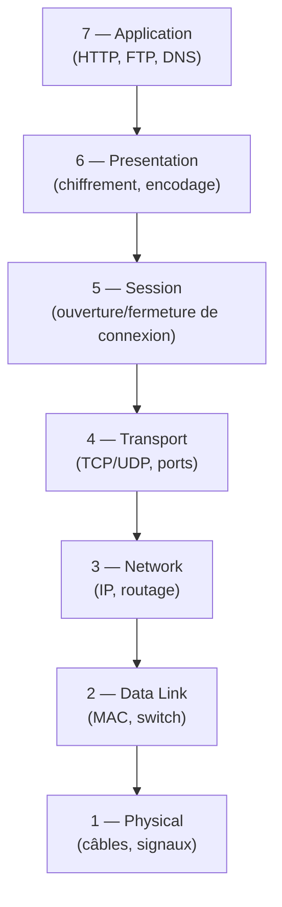
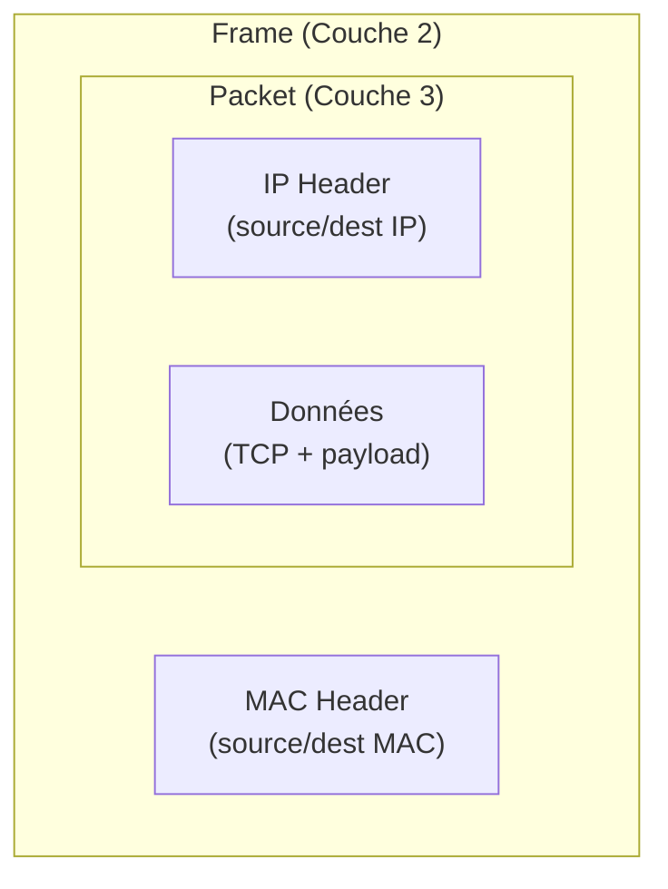

# Network Fundamentals — TryHackMe Pre-Security

> Rooms couvertes : *What is Networking*, *Intro to LAN*, *OSI Model*, *Packets and Frames*, *Extending your Network*
> Path : Pre-Security

## 🌐 LAN vs Internet

Un **LAN (Local Area Network)** est un réseau déployé localement, accessible uniquement par les appareils qui y ont accès — physiquement (câbles) ou par la portée des ondes (Wi-Fi). **Internet** est lui aussi un réseau, mais à une échelle globalisée : il interconnecte des millions de LAN entre eux pour permettre une communication et un partage de données en temps réel à l'échelle mondiale.

**Vérification pratique (lab Kali + Ubuntu sur VirtualBox NAT Network)** :
Pour confirmer que deux machines sont sur le même LAN virtuel, on compare leurs adresses IP avec `ip a`. Si les deux machines partagent le même préfixe réseau (ex. `10.0.0.0/24`), avec des adresses comme `10.0.0.2` et `10.0.0.3`, elles sont sur le même segment.

```bash
ip a
```

## 🔀 Switch vs Routeur

- **Switch** : fait communiquer les appareils **au sein d'un même réseau**, en se basant sur les adresses MAC.
- **Routeur** : achemine les paquets **entre réseaux différents**, en s'appuyant sur des tables de routage et la collaboration avec d'autres routeurs.

> **Note** : les switchs modernes (niveau 3) peuvent jouer un rôle proche du routeur dans certains cas, notamment avec les **VLAN**, qui permettent de segmenter logiquement des appareils pourtant connectés physiquement au même réseau.

## 📚 Table des matières

- [LAN vs Internet](#-lan-vs-internet)
- [Switch vs Routeur](#-switch-vs-routeur)
- [Pourquoi un modèle en couches (OSI) ?](#-pourquoi-un-modèle-en-couches-osi)
- [Frame vs Packet](#-frame-vs-packet)
- [Observation dans Wireshark](#-observation-dans-wireshark)
- [Hub vs Switch](#-hub-vs-switch)
- [Ce que j'ai retenu](#-ce-que-jai-retenu)

## 🧩 Pourquoi un modèle en couches (OSI) ?

Le modèle OSI répond à un problème de **complexité** : transporter des données à travers le monde implique de nombreux processus (adressage physique, routage, fiabilité du transport, formatage des données...). Diviser ce processus en couches permet de :
- Isoler chaque responsabilité (chaque couche a un rôle précis)
- Faciliter le diagnostic : en cas de problème, on peut cibler la couche concernée au lieu de chercher dans un bloc monolithique



*Chaque couche ne communique qu'avec celle juste au-dessus et juste en-dessous d'elle — c'est ce qui permet d'isoler un problème (ex. un souci de câble = couche 1, un souci de routage = couche 3).*

## 📦 Frame vs Packet

Ce sont deux unités de données associées à deux couches différentes :

| Élément | Couche OSI | En-tête ajouté |
|---|---|---|
| **Packet** | Couche 3 — Network | IP header (adresses IP source/destination) |
| **Frame** | Couche 2 — Data Link | MAC header (adresses MAC source/destination) |

### Encapsulation

Quand un packet doit être envoyé physiquement, il n'est **pas détruit ni transformé** : il est **encapsulé** dans un frame, qui lui ajoute un en-tête contenant l'adresse MAC du prochain saut (next hop — généralement le routeur suivant sur le chemin). Le packet d'origine reste intact à l'intérieur.



*Le packet n'est jamais "cassé" : il est mis dans une "caisse" (le frame) qui porte juste une étiquette supplémentaire (l'en-tête MAC) pour le trajet local.*

## 🔍 Observation dans Wireshark

Lors d'une capture de traffic FTP en clair, Wireshark affiche chaque **packet** capturé avec :
- L'horodatage de la capture
- L'adresse IP source et destination
- Le protocole (ex. TCP)
- Les flags TCP (SYN, ACK, etc. — indicateurs de l'état de la connexion)

Wireshark présente en réalité toute la pile encapsulée pour chaque trame capturée (Frame → IP → TCP → données applicatives), consultable en détail dans le panneau inférieur de l'interface.

## 🛜 Hub vs Switch

- **Hub** : diffuse les données reçues à **tous** les ports connectés, sans distinction (broadcast physique). Génère beaucoup de traffic inutile et des collisions.
- **Switch** : apprend quelle adresse MAC est connectée à quel port (table MAC), et n'envoie le frame qu'au port concerné. Le traffic est donc dirigé intelligemment plutôt que diffusé partout.

C'est cette capacité de filtrage ciblé qui rend le switch largement préféré au hub dans les réseaux modernes.

🔄 Erreurs de parcours


Cette section liste les points où j'ai hésité ou mal compris au départ — gardé volontairement pour suivre ma propre progression, pas juste afficher la version "propre".


Frame vs Packet


Avant : je mélangeais tout le temps les deux, sans réflexe clair pour les distinguer.
Correction : le distinguo se fait par la couche OSI concernée — packet = couche 3 (en-tête IP), frame = couche 2 (en-tête MAC). Ce n'est pas une différence de taille ou de moment, mais d'en-tête ajouté à chaque étape de l'encapsulation.
Pourquoi ça aide : penser "à quelle couche je suis" avant de nommer l'objet retire l'ambiguïté — le terme suit la couche, pas l'inverse.

## 💡 Ce que j'ai retenu

- La distinction frame/packet est liée à la couche OSI concernée, pas à une différence de "taille" ou de "moment" — c'est un changement d'en-tête à chaque couche traversée (encapsulation).
- Le modèle en couches n'est pas qu'un concept théorique : il structure concrètement comment je dois lire un outil comme Wireshark ou penser un schéma réseau (où placer un switch vs un routeur).
- Les VLAN montrent que la frontière switch/routeur n'est pas toujours stricte dans le matériel moderne — bon réflexe à garder pour la suite (réseaux d'entreprise, segmentation en pentest).
